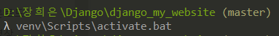
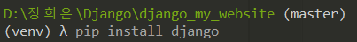
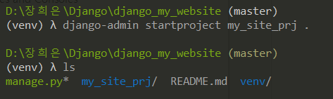
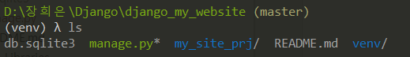

# django 설치; django 프로젝트 만들기

### 1. 가상환경 실행

- 프로젝트 폴더 내에서 진행

  ```bash
  venv\Scripts\activate.bat
  ```

   


### 2. django 설치

- 프로젝트 폴더에서 가상환경이 실행된 상태에서 진행

  ```
  pip install django
  ```

   


### 3. start Project

- 프로젝트 생성

  `django-admin startproject [프로젝트 이름] .` 으로 프로젝트 생성

  마지막에 `.`을 넣어줘야 manage.py 폴더가 프로젝트 폴더 밖에 생성됨

  ```bash
  django-admin startproject my_site_prj .
  ```

   


### 4. migrate

- DB 생성

  명령어 실행 후 db.sqlite3 파일이 생성된 것을 확인 가능

  ```
  python manage.py migrate
  ```

   


### 5. runserver

- server 실행

  ```
  python manage.py runserver
  ```

  

### +) .gitignore

```
venv/
.idea/

*.pyc


db.sqlite3

```