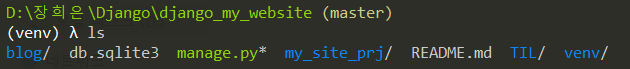
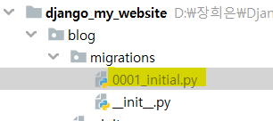

# Blog 앱 만들기; Post 모델 만들기; admin에 추가하기

### 1. blog app 만들기

- python manage.py startapp [app 이름]

  ```bash
  python manage.py startapp blog
  ```

   

- `blog/migrations` 폴더 내에 migration이 진행되면 생성되는 파일이 git에 올라가지 않도록 ` .gitignore` 변경

  ```
  migrations/
  ```

  

### 2. Post 모델 만들기

- blog/models.py

  ```python
  from django.db import models
  from django.contrib.auth.models import User
  
  
  class Post(models.Model):
      title = models.CharField(max_length=30)
      content = models.TextField()
  
      created = models.DateTimeField()
      author = models.ForeignKey(User, on_delete=True)
  ```


### 3. admin

- Django는 기본적으로 admin 페이지를 제공해줌

- admin에 접근 가능한 `SuperUser` 생성

  ```
  python manage.py createsuperuser
  ```

  

### 4. admin과 models.py 연결

- admin 페이지에 models.py에 생성한 `POST`클래스가 보이려면 장고에게 알려줘야 함

- settings.py

  `INSTALLED_APPS`에 'blog' 추가

- cmder에서 아래 명령어 수행

  ```
  python manage.py makemigrations blog
  ```

  `0001_initial.py` 파일 생성된 것을 확인 가능 - **이 파일은 관리되면 안 됨**(직접적으로 수정할 일이 없음)

   


### admin 페이지에 추가

- admin.py

  ```python
  from django.contrib import admin
  from .models import Post
  
  
  admin.site.register(Post)
  
  ```

- cmder에서 아래 명령어 수행

  ```
  python manage.py migrate
  ```